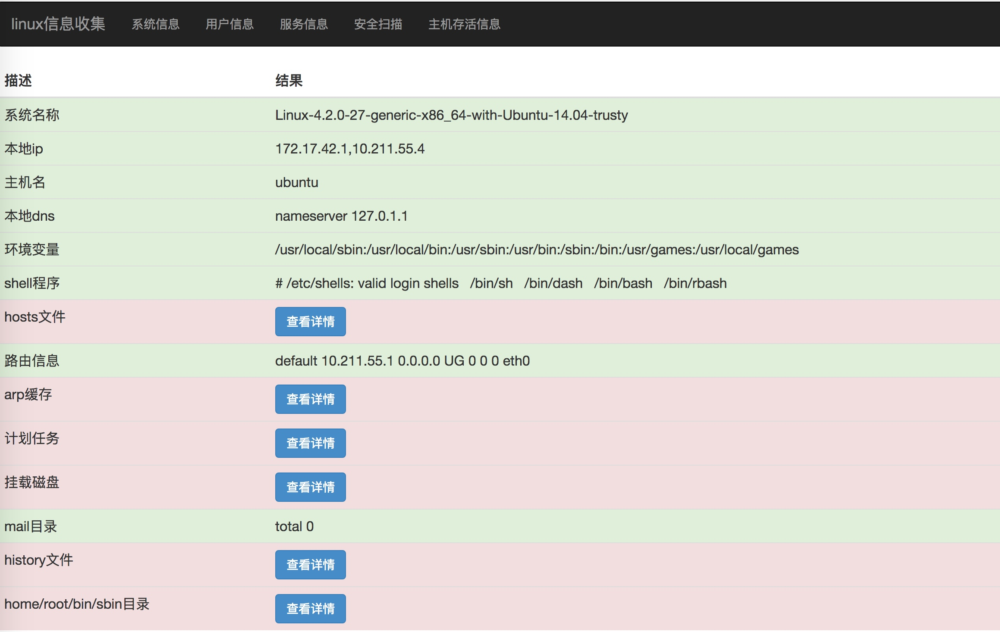
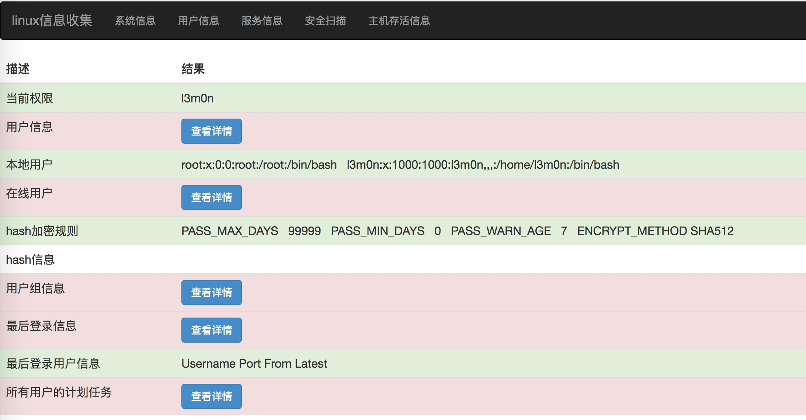
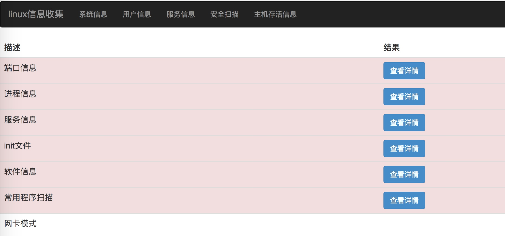
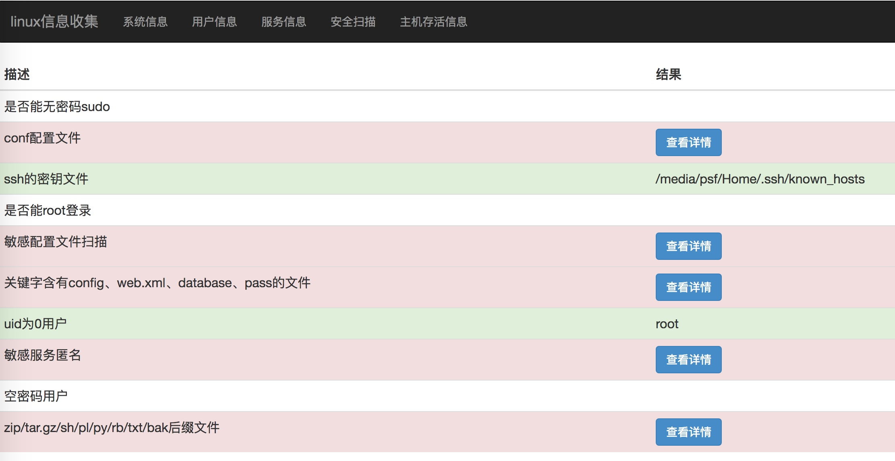

[TOC]

### 产品介绍

linux_information是一款针对linux下信息收集的工具

##### 主要模块：

+ 系统信息，能了解主机的地址、版本等信息
+ 用户信息，能了解主机的用户、分组、登陆等情况
+ 服务信息，能了解主机的端口、进程、服务、软件等信息
+ 安全扫描，能了解主机的敏感文件、能利用的漏洞等信息
+ 主机存活信息，能了解当前内网存活主机信息

##### 目录结构：

```
.
├── comm
│   ├── __init__.py
│   ├── function.py		数据处理
│   ├── outprint.py		结果输出html
│   └── scan.py		信息收集
├── config		配置字典
│   ├── banner.txt		端口指纹
│   ├── command.txt		常见软件
│   ├── commandInfo
│   │   ├── fileInfo.txt	文件信息的命令字典
│   │   ├── serviceInfo.txt		服务信息的命令字典
│   │   ├── systemInfo.txt		系统信息的命令字典
│   │   └── userInfo.txt		用户信息的命令字典
│   ├── conffile.txt		配置文件信息的命令字典1
│   ├── file.txt		配置文件信息的命令字典2(带绝对路径)
│   ├── ftp.sh			ftp匿名猜测
│   └── service.txt		服务信息
├── go.py		主程序
└── result		存放报告
```

### 配置说明
主要是用字典爆破、linux命令结果获取、python自带模块，对其进行数据处理来达到信息收集。

##### 字典爆破
文件：config/*.txt

比如可执行命令软件，则是通过获取每一行数据，然后执行看有无返回路径数据。其中program就是每一行的数据。

```
which {program} 2>/dev/null
```

##### 命令收集
文件：config/commandInfo/*.txt

命令信息格式：

```
# 标记值，最后也是做键名
+ 对命令的解释，也是最后显示到结果页面的说明
> 命令
```

比如：

```
# a_sudo
+ 是否能无密码sudo
> echo '' | sudo -S -l 2>/dev/null
```

##### 其他方式
文件：comm/scan.py

最后的是通过其他方式，比如python自带的对系统信息收集。

添加新信息收集格式

```
一个模块的数据格式是

xxInfo = {
	"info" : "[[commad,readme],[result]]",
    "info1" : "[[commad,readme],[result]]",
    "info2" : "[[commad,readme],[result]]",
}

所以为这个模块字典添加数据格式是：

self.xxxInfo['info'] = [['info','当前说明'],[获取方式]]
```

比如：
```
self.systemInfo['a_info'] = [['python_get','系统名称'],[platform.platform()]]
```

##### 结果显示顺序配置
由于字典在遍历字典的键名并不是有序的，所以做了一个sort排序，如果想让哪些信息放后面显示，则可以通过控制键名来。

比如：

```
self.xxxInfo['info'] = [['info','当前说明'],[获取方式]]
self.xxxInfo['info1'] = [['info1','当前说明'],[获取方式]]
self.xxxInfo['info2'] = [['info2','当前说明'],[获取方式]]

所以最后这个模块的数据是：
xxInfo = {
	"info" : "[[commad,readme],[result]]",
    "info1" : "[[commad,readme],[result]]",
    "info2" : "[[commad,readme],[result]]",
}
显示顺序为：
info
info1
info2
```

现在改变一下键名：

```
self.xxxInfo['c_info'] = [['info','当前说明'],[获取方式]]
self.xxxInfo['b_info1'] = [['info1','当前说明'],[获取方式]]
self.xxxInfo['a_info2'] = [['info2','当前说明'],[获取方式]]
```

这样最后的显示顺序就是

```
info2
info1
info
```

### 模块说明

##### 系统信息

```
系统名称
本地ip
主机名
本地dns
环境变量
shell程序
hosts文件
路由信息
arp缓存
计划任务
挂载磁盘
mail目录
history文件
home/root/bin/sbin目录
```

##### 用户信息

```
当前权限
用户信息
本地用户
在线用户
hash加密规则
hash信息
用户组信息
最后登录信息
最后登录用户信息
所有用户的计划任务
```

##### 服务信息

```
端口信息
进程信息
服务信息
init文件
软件信息
常用程序扫描
网卡模式
```

##### 安全扫描

```
是否能无密码sudo
conf配置文件
ssh的密钥文件
是否能root登录
敏感配置文件扫描
关键字含有config、web.xml、database、pass的文件
uid为0用户
敏感服务匿名
空密码用户
zip/tar.gz/sh/pl/py/rb/txt/bak后缀文件
```

##### 主机存活信息

### 生成报告
运行go.py之后，结果将在result目录下生成一个命名为当前时间戳的目录，其目录有一个result.html以及files的目录，这个files目录是存放服务器获取到的敏感配置文件信息。

### 结果展示
系统信息:



用户信息:



服务信息:



安全扫描:




